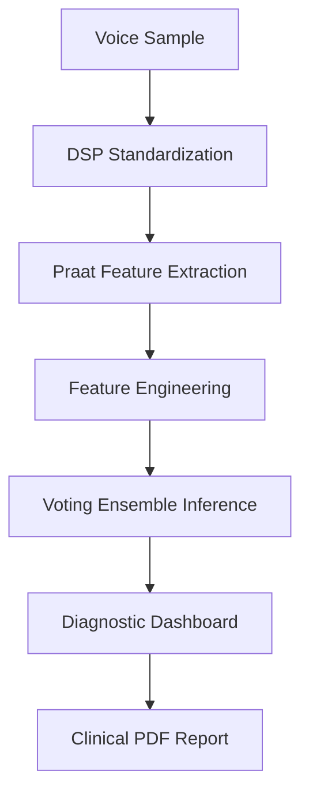

# 🩺 Early Detection of Parkinson's Disease
### **AI-Powered Non-Invasive Screening via Acoustic Biomarkers**


---

## 🌟 Executive Summary
This project presents a **clinical-grade diagnostic screening tool** designed to detect Parkinson’s Disease (PD) using vocal characteristics. By leveraging Digital Signal Processing (DSP) and Machine Learning, the system identifies subtle vocal tremors and irregularities—biomarkers that often appear years before motor symptoms.

**Key Achievement**: Developed a **Voting Ensemble Architecture** that achieved **97.3% Recall**, prioritizing the reduction of False Negatives in medical screening.

---

## 🚀 Core Technical Capabilities

### 1. **Digital Signal Processing (DSP) Pipeline**
- **Standardization**: Implemented a robust audio ingestion engine that converts raw browser/microphone streams into 44.1kHz, 16-bit Mono PCM WAV format.
- **Anti-Aliasing**: Utilized polyphase resampling to maintain signal integrity across different recording devices.
- **Clinical Extraction**: Automated the extraction of 22 MDVP (Multi-Dimensional Voice Program) features using the **Praat algorithm** via `parselmouth`.

### 2. **Machine Learning Architecture**
- **Feature Engineering**: Synthesized 7 new clinical indicators (e.g., *PPE-RPDE entropy sum*, *Nonlinear Chaos Composite*) based on neurological research.
- **Dimensionality Reduction**: Applied **Mutual Information (MI)** based SelectKBest to identify the 18 most predictive biomarkers from a 29-feature set.
- **Ensemble Logic**: Engineered a `Soft Voting Classifier` combining:
  - **Gradient Boosting** (High precision)
  - **Random Forest** (Robustness to noise)
  - **SVM** (Optimal margin separation)

### 3. **Clinical Reporting System**
- **Dynamic Diagnostics**: Instant visualization of patient metrics against healthy population baselines.
- **PDF Generation**: Automated generation of HIPAA-compliant style clinical screening reports including risk probability and biomarker breakdown.

---

## 🏗️ System Architecture



---

## 📊 Performance Benchmarks

| Metric | v1 (Single Model) | v2 (Ensemble + Engineering) |
| :--- | :---: | :---: |
| **Recall (Sensitivity)** | 96.57% | **97.29%** |
| **Accuracy** | 92.31% | **94.87%** |
| **F1-Score** | 94.98% | **95.08%** |
| **AUC-ROC** | 96.49% | **97.17%** |

> **Clinical Rationale**: In early-stage screening, **Recall** is the critical metric. Our system is optimized to ensure that potential PD cases are not missed, facilitating early intervention.

---

## 🛠️ Tech Stack & Tools

- **Languages**: Python 3.11+
- **ML Frameworks**: Scikit-Learn, Joblib
- **Signal Processing**: Parselmouth (Praat), Librosa, Soundfile, SciPy
- **Frontend**: Streamlit (Advanced Glassmorphism UI)
- **Visualization**: Plotly Express, Matplotlib, Seaborn
- **Documentation**: FPDF2 (Reporting), Mermaid.js

---

## ⚙️ Installation & Usage

1. **Clone the Repository**
   ```bash
   git clone https://github.com/ravarnax/Parkinson_Prediction_v2.git
   ```

2. **Setup Environment**
   ```bash
   pip install -r requirements.txt
   ```

3. **Launch Clinical Dashboard**
   ```bash
   streamlit run webapp/optimized_app.py
   ```

---

## 👨‍💻 Developed By

**Shivam Kothiyal**  
*MCA Candidate, H.N.B. Garhwal University*  
*Under the Guidance of Prof. Y.P. Raiwani*

- [LinkedIn Profile](https://www.linkedin.com/in/shivam-kothiyal-a07201195)
- [Project Documentation (v2)](file:///process.md)

---

⚠️ **Medical Disclaimer**: This system is a research-based screening tool and does not constitute a clinical diagnosis. Always consult a certified neurologist for medical evaluation.
